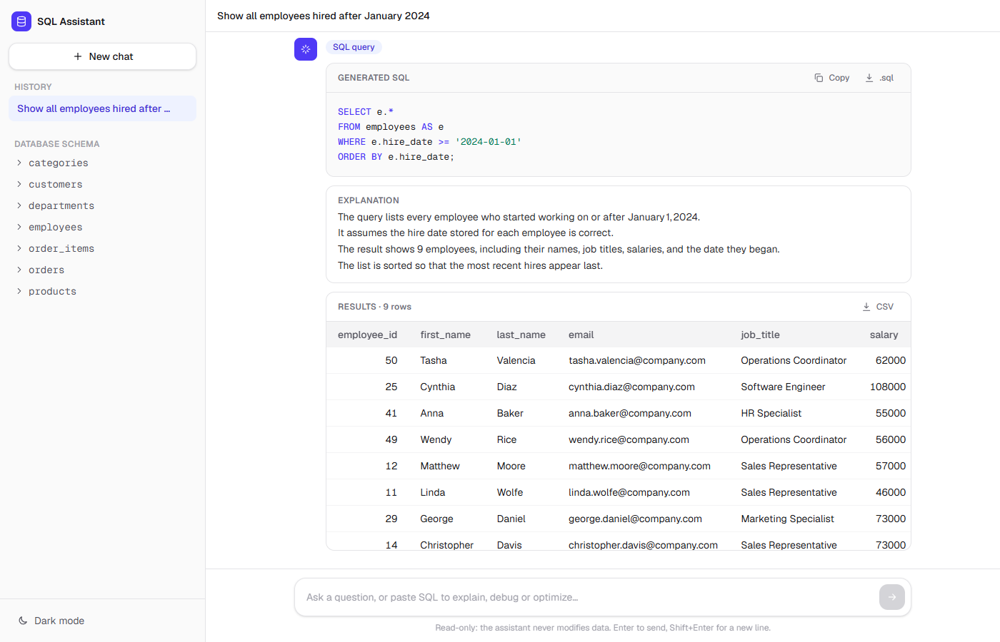
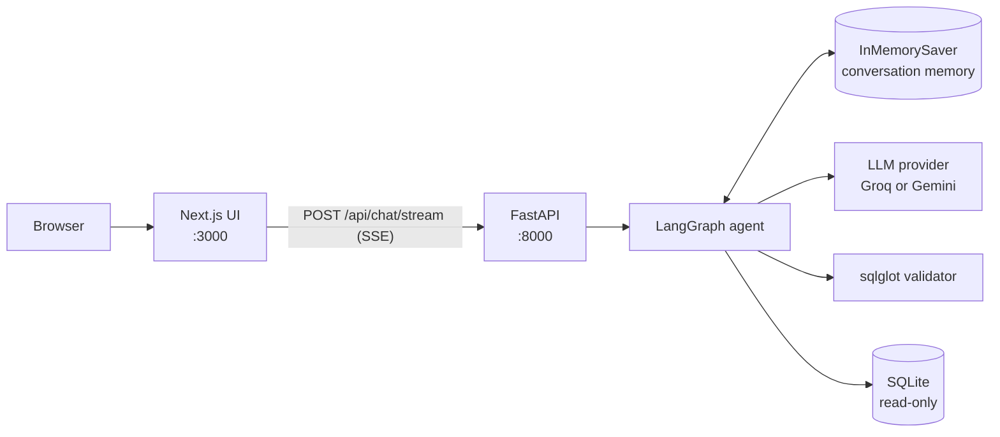
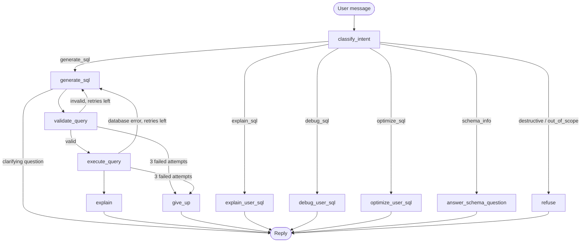
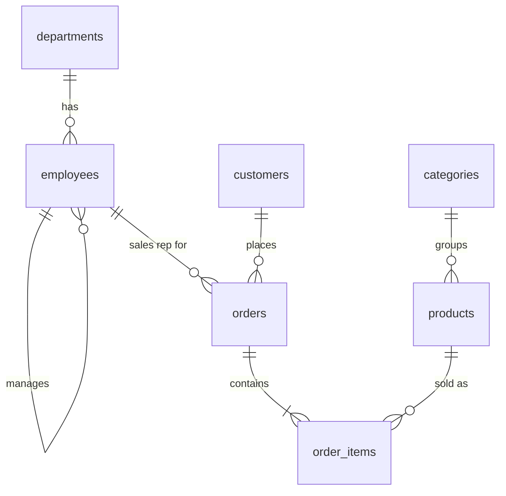

# SQL Query AI Agent

A task-focused AI agent that turns natural-language questions into **validated, read-only SQL**, runs it against a sample retail database, and explains the result in plain English. It can also explain, debug and optimize SQL that the user pastes in, keeps conversation context for follow-up questions, and refuses anything outside SQL and the provided schema.

Built with **LangGraph** (orchestration), **FastAPI** (API with streaming), **SQLite** (database), **sqlglot** (deterministic SQL validation) and **Next.js** (web UI).



**Demo video:** _link to be added_

---

## Contents

- [Quick start](#quick-start)
- [API and interactive docs](#api-and-interactive-docs)
- [Features](#features)
- [Architecture](#architecture)
- [LangGraph workflow](#langgraph-workflow)
- [Guardrails and validation](#guardrails-and-validation)
- [Prompts](#prompts)
- [Database schema](#database-schema)
- [Tests](#tests)
- [Project structure](#project-structure)
- [Design decisions and assumptions](#design-decisions-and-assumptions)
- [Limitations and possible extensions](#limitations-and-possible-extensions)

---

## Quick start

You need an LLM API key. The default provider is **Groq** (free key at [console.groq.com](https://console.groq.com)); **Google Gemini** is also supported.

```bash
cp backend/.env.example backend/.env
# then edit backend/.env and set GROQ_API_KEY
```

### Option A — Docker (one command)

```bash
docker compose up --build
```

Open **http://localhost:3000** (UI) and **http://localhost:8000/docs** (API docs). Stop with `docker compose down`.

### Option B — Run locally

Requirements: Python 3.11+, Node.js 20+.

```bash
# Terminal 1 — backend (http://localhost:8000)
cd backend
python -m venv .venv
.venv\Scripts\activate          # macOS/Linux: source .venv/bin/activate
pip install -r requirements.txt
python -m app.db.seed           # creates app/db/company.db
uvicorn app.main:app --reload --port 8000
```

```bash
# Terminal 2 — frontend (http://localhost:3000)
cd frontend
npm install
npm run dev
```

### Configuration (`backend/.env`)

| Variable | Default | Purpose |
|---|---|---|
| `GROQ_API_KEY` | — | Required when `LLM_PROVIDER=groq` |
| `GOOGLE_API_KEY` | — | Required when `LLM_PROVIDER=gemini` |
| `LLM_PROVIDER` | `groq` | `groq` or `gemini` |
| `CLASSIFIER_MODEL` / `GENERATOR_MODEL` / `EXPLAINER_MODEL` | Groq: `openai/gpt-oss-20b` / `openai/gpt-oss-120b` / `openai/gpt-oss-20b` | Override the model used for each role |
| `FRONTEND_ORIGINS` | `http://localhost:3000` | Comma-separated origins allowed by CORS |

The frontend reads `NEXT_PUBLIC_API_URL` (default `http://localhost:8000`).

---

## API and interactive docs

FastAPI generates interactive documentation from the code:

- **Swagger UI:** http://localhost:8000/docs — try every endpoint from the browser ("Try it out")
- **ReDoc:** http://localhost:8000/redoc

| Method | Path | Description |
|---|---|---|
| `POST` | `/api/chat` | Send a message; returns the full answer as JSON |
| `POST` | `/api/chat/stream` | Same, as Server-Sent Events: a `progress` event as each workflow step starts, then a `result` (or `error`) event |
| `GET` | `/api/schema` | Tables, columns and foreign keys |
| `GET` | `/api/health` | Liveness check |

**Request** — reuse the same `thread_id` for follow-up questions; a new one starts a new conversation:

```bash
curl -X POST http://localhost:8000/api/chat \
  -H "Content-Type: application/json" \
  -d '{"message": "Show all employees hired after January 2024", "thread_id": "demo-1"}'
```

**Response** — each UI panel reads its own field:

```json
{
  "thread_id": "demo-1",
  "intent": "generate_sql",
  "reply": "```sql\nSELECT ...\n```\n\nThe query lists ...",
  "sql": "SELECT e.* FROM employees AS e WHERE e.hire_date >= '2024-01-01' ORDER BY e.hire_date;",
  "explanation": "The query lists every employee who started on or after January 1, 2024 ...",
  "warnings": [],
  "result": { "columns": ["employee_id", "first_name", "..."], "rows": [[50, "Tasha", "..."]], "row_count": 9, "truncated": false }
}
```

**Status codes:** `422` invalid input (empty or over 2,000 characters, missing `thread_id`) · `503` LLM rate limit ("The AI service is busy…") · `500` unexpected error (generic message; details only in server logs).

**Streaming** (`curl -N` shows events as they arrive):

```text
event: progress
data: {"step": "classify_intent", "label": "Understanding your question…"}

event: progress
data: {"step": "generate_sql", "label": "Writing SQL…"}
...
event: result
data: { ...same shape as /api/chat... }
```

---

## Features

| Requirement | How it is met |
|---|---|
| Natural language → SQL | Generator writes SQLite using the live schema, column comments and sample values |
| SQL validation | Deterministic `sqlglot` checks: syntax, single statement, read-only, tables, columns, relationships |
| Refuse destructive operations | Classifier refuses; validator rejects; database connection is read-only |
| SQL explanation | Plain-English explanation of every generated query and its result |
| SQL optimization | Readability and performance improvements, index suggestions, removed joins; the new query is validated **and run to confirm it returns the same rows** |
| SQL debugging | Uses real evidence (validator findings, the actual database error or result) to identify the issue, explain it and return a validated fix |
| Conversation context | LangGraph checkpointer per `thread_id`; follow-ups modify the previous query |
| Out-of-scope handling | Classifier refuses general knowledge, sports, politics, maths, other programming, creative writing and prompt-injection attempts |
| Frontend | Chat, SQL panel (copy, download `.sql`), explanation panel, results table (download CSV), conversation history, live progress, error messages with retry, schema browser, dark mode, mobile layout |
| Bonus | SQL execution, follow-ups, syntax highlighting, CSV export, prompt-injection protection, streaming, Docker Compose, 96 automated tests |

---

## Architecture



- **Frontend** (`frontend/`): Next.js 16 + TypeScript + Tailwind. Streams progress from the API, keeps the chat list in `localStorage`.
- **API** (`backend/app/main.py`): request validation, error mapping, JSON and SSE endpoints.
- **Agent** (`backend/app/agent/`): LangGraph state graph. `llm.py` hides the vendor, so switching Groq ↔ Gemini is a `.env` change.
- **Validator** (`backend/app/validation/validator.py`): pure Python, no LLM — testable and free.
- **Database** (`backend/app/db/`): SQLite, schema read from the database itself, every agent connection opened read-only.

---

## LangGraph workflow



| Node | Model | What it does |
|---|---|---|
| `classify_intent` | small | One structured-output call does **intent detection and scope validation** together: one of `generate_sql`, `explain_sql`, `optimize_sql`, `debug_sql`, `schema_info`, `destructive`, `out_of_scope`, plus any SQL the user pasted. Also resets per-question state. |
| `generate_sql` | large | Writes one SQLite `SELECT` (or asks a clarifying question if no reasonable assumption is possible). On a retry, the failed SQL and the validator's errors are added to the prompt. |
| `validate_query` | — | Runs the deterministic validator. Errors trigger a retry; join warnings are passed to the user. |
| `execute_query` | — | Runs the SQL (read-only, 5 s timeout, 500-row cap). A database error is treated like a validation error and retried. |
| `explain` | small | Explains the query and result in 2–4 plain sentences, mentioning assumptions and warnings. |
| `give_up` | — | After 3 failed attempts, says so instead of returning SQL known to be broken. |
| `explain_user_sql` | small | Explains the user's query clause by clause (with validator findings), or a general SQL concept with an example on this schema. |
| `debug_user_sql` | large | Gathers evidence first (validator findings; if valid, runs it and reports rows or the error), then returns issue / explanation / corrected SQL. The fix must pass validation to be shown. |
| `optimize_user_sql` | large | Returns changes, index suggestions and an optimized query; validates it and **runs both queries to compare their rows**. |
| `answer_schema_question` | small | Answers "what tables / columns / relationships exist" from the live schema. |
| `refuse` | — | Fixed text for destructive and out-of-scope requests (no LLM call, cannot be manipulated). |

**State** (`backend/app/agent/state.py`): `messages` uses the `add_messages` reducer so the conversation accumulates; per-question fields (`generated_sql`, `validation_errors`, `retry_count`, `query_result`, …) are reset at the start of each turn. **Memory:** the graph is compiled with an `InMemorySaver` checkpointer; each `thread_id` is a separate conversation. **Structured outputs** use JSON-schema mode so the model's output always matches the Pydantic model.

---

## Guardrails and validation

Defense in depth — each layer catches what the previous one might miss:

| Layer | Protects against |
|---|---|
| Input limits (Pydantic) | Empty or oversized messages (>2,000 chars) before any LLM call |
| Intent classifier | Destructive requests (however politely phrased), off-topic questions, prompt injection ("ignore your instructions…") |
| Generator prompt rules | Write statements, invented tables/columns, wrong value formats (`'CA'`, `'cancelled'`), wrong revenue column, LEFT JOIN filter mistakes |
| **Deterministic validator** (`sqlglot`) | Syntax errors; multiple statements (`SELECT …; DROP …`); any non-query statement — an allowlist (`exp.Query`) plus a blocklist walk that also catches hidden writes like `WITH … DELETE`; unknown tables (CTE names allowed); unknown/ambiguous columns resolved through aliases, CTEs and subqueries; joins that don't follow a foreign key (warning) |
| Retry loop | LLM mistakes are fixed using the validator's exact error messages (max 2 retries) |
| **Read-only database connection** | Any write reaching SQLite fails (`mode=ro`) |
| Query timeout and row cap | Runaway queries (stopped after 5 s) and huge results (first 500 rows, flagged) |
| Output checks | Debug fixes and optimized queries are validated before being shown; optimizations are checked for identical results |
| Error handling | Rate limits → friendly 503; internal errors never exposed to users |

---

## Prompts

All prompts live in one file: **[`backend/app/agent/prompts.py`](backend/app/agent/prompts.py)**.

| Prompt | Used by | Purpose |
|---|---|---|
| `CLASSIFIER_PROMPT` | `classify_intent` | Intent definitions with few-shot examples, rules for follow-ups, mixed requests and prompt injection |
| `GENERATOR_PROMPT` | `generate_sql` | Schema plus SQL rules (read-only, exact values, revenue formula, date handling, follow-ups, assume-vs-clarify) |
| `GENERATOR_RETRY_PROMPT` | `generate_sql` (retries) | Adds the failed SQL and the validator's errors |
| `EXPLAINER_PROMPT` | `explain` | Plain-English explanation from the question, SQL, plan, warnings and a result preview |
| `SCHEMA_INFO_PROMPT` | `answer_schema_question` | Answer structure questions using only the schema |
| `EXPLAIN_QUERY_PROMPT` / `EXPLAIN_CONCEPT_PROMPT` | `explain_user_sql` | Clause-by-clause explanation with validator findings / concept explanation with an example |
| `DEBUG_PROMPT` | `debug_user_sql` | Diagnose using validator findings and the real run outcome; minimal fix |
| `OPTIMIZE_PROMPT` | `optimize_user_sql` | Readability, performance, existing indexes, index suggestions; same results required |
| `OUT_OF_SCOPE_MESSAGE`, `DESTRUCTIVE_MESSAGE`, `GIVE_UP_MESSAGE` | `refuse`, `give_up` | Fixed replies (no LLM) |

The schema given to the LLM is generated from the database at runtime (`get_schema_for_prompt()`): the original `CREATE TABLE` statements **including their column comments**, plus sample values per column (every value if a column has ≤ 20 distinct values, otherwise 3 examples). This is what lets the agent map "California" to `'CA'` and "cancelled" to the exact stored value.

---

## Database schema

Sample retail company database — **[`backend/app/db/schema.sql`](backend/app/db/schema.sql)**. Covers simple filters, multi-table joins, a many-to-many bridge, a self-join, aggregations and NULL handling.



| Table | Key columns |
|---|---|
| `departments` | department_id, name, location |
| `employees` | employee_id, first_name, last_name, email, job_title, salary, hire_date, department_id → departments, manager_id → employees |
| `customers` | customer_id, first_name, last_name, email, city, state (2-letter US code, NULL outside the USA), country, signup_date |
| `categories` | category_id, name |
| `products` | product_id, name, category_id → categories, price (current list price), stock_quantity |
| `orders` | order_id, customer_id → customers, employee_id → employees, order_date, status (`pending`, `shipped`, `delivered`, `cancelled`) |
| `order_items` | order_item_id, order_id → orders, product_id → products, quantity, unit_price (price at purchase time) |

**Sample data** is generated by [`backend/app/db/seed.py`](backend/app/db/seed.py) with a fixed random seed, so it is identical on every machine: 8 departments, 50 employees, 200 customers, 60 products, 1,000 orders (2023–2025), 2,973 order items. It includes deliberate edge cases: products that were never ordered, customers without orders, discounted order lines, international customers without a state.

---

## Tests

```bash
cd backend
pip install -r requirements-dev.txt
pytest
```

96 tests, ~5 seconds, **no API key or LLM calls needed** — every LLM is replaced by a scripted fake.

| File | Covers |
|---|---|
| `tests/test_validator.py` | All validator checks, including 14 kinds of write/admin statements |
| `tests/test_database.py` | Read-only enforcement, timeout, row cap, schema reader, seed data |
| `tests/test_agent.py` | Every intent's path, retry → success, retry → give up, database-error retry, clarification, memory per thread, per-turn state reset |
| `tests/test_api.py` | 422 / 503 / 500 handling, response shape, hidden SQL after give-up, streaming event order, CORS |

---

## Project structure

```
backend/
  app/
    main.py                 FastAPI app: /api/chat, /api/chat/stream, /api/schema, /api/health
    config.py               Settings (provider, models, paths, limits)
    agent/
      graph.py              LangGraph wiring: nodes, routers, retry loop, checkpointer
      nodes.py              One function per workflow step
      state.py              Graph state and structured-output models
      prompts.py            All prompts and fixed replies
      llm.py                Provider-neutral model factory (Groq / Gemini)
    validation/validator.py Deterministic sqlglot validator
    db/
      schema.sql            Sample database schema
      seed.py               Reproducible sample data
      database.py           Read-only access, schema reader, query runner
  tests/                    pytest suite (fake LLMs)
frontend/
  src/app/                  Next.js page and layout
  src/components/           Chat UI components
  src/lib/                  API client (SSE), types, storage, downloads
docker-compose.yml
```

---

## Design decisions and assumptions

- **Validation is deterministic, not LLM-based.** An LLM asked "is this SQL valid?" can be wrong; the AST-based validator is predictable, testable and free.
- **One LLM call for intent + scope**, a small model for classification/explanation and a large model for writing SQL — fewer calls, lower latency and cost.
- **Assume, then say so.** Vague requests ("best products") get a reasonable assumption stated in the explanation; clarifying questions only when no assumption is sensible.
- **Relative dates** ("last month", "this year") are interpreted relative to **2025-12-31**, the end of the sample data.
- **"After January 2024"** includes January (`>= '2024-01-01'`), matching the assignment's example.
- **All order statuses are included** unless the user asks otherwise; revenue is `quantity * unit_price` (price at purchase), not today's list price.
- **Results are capped at 500 rows** in responses (flagged as truncated); queries stop after 5 seconds.
- **Conversation memory is in-memory** and resets when the backend restarts; the UI keeps its chat list in the browser.
- **SQLite** keeps setup to zero; lowercase snake_case names keep the SQL portable to PostgreSQL/MySQL.

---

## Limitations and possible extensions

- **Persistent memory:** swap `InMemorySaver` for LangGraph's `SqliteSaver`/`PostgresSaver` so conversations survive restarts.
- **Multiple SQL dialects:** `sqlglot` already parses PostgreSQL and MySQL; supporting them end to end means a connection layer per engine and a dialect setting in the prompts.
- **Query cost estimation:** run `EXPLAIN QUERY PLAN` and surface full scans before execution.
- **Free-tier rate limits:** the Groq free tier allows about 8,000 tokens per minute per model (≈3 SQL questions per minute); heavier use needs a paid tier.
- **Single database:** the agent works with the provided schema only, by design.
